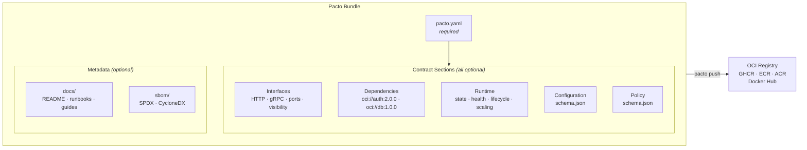

[](https://github.com/TrianaLab/pacto/actions/workflows/ci.yml)
[](https://pkg.go.dev/github.com/trianalab/pacto)
[](https://goreportcard.com/report/github.com/trianalab/pacto)
[](https://codecov.io/github/TrianaLab/pacto)
[](https://github.com/TrianaLab/pacto/releases/latest)
[](LICENSE)

# Pacto

**Pacto is to service operations what OpenAPI is to HTTP APIs.**

Pacto (/ˈpak.to/ — Spanish for *pact*) is a contract system for cloud-native services. You describe a service's operational behavior once — interfaces, dependencies, runtime semantics, configuration, scaling — and Pacto validates it, distributes it, verifies it at runtime, and lets humans explore it.

The system has three pieces that work together:

| Component | Role | When it runs |
|-----------|------|--------------|
| **CLI** | Author, validate, diff, publish contracts | Design-time and CI |
| **Dashboard** | Explore services, dependency graphs, versions, diffs, insights | Anytime — local or deployed |
| **[Operator](https://github.com/TrianaLab/pacto-operator)** | Track contracts in-cluster, link to workloads, verify runtime consistency | Continuously in Kubernetes |

No sidecars. No new infrastructure. The CLI uses your existing OCI registry. The operator watches CRDs. The dashboard reads from all sources.

**[Documentation](https://trianalab.github.io/pacto)** · **[Quickstart](https://trianalab.github.io/pacto/quickstart)** · **[Specification](https://trianalab.github.io/pacto/contract-reference)** · **[Examples](https://trianalab.github.io/pacto/examples)** · **[Demo](https://github.com/TrianaLab/pacto-demo)**

---

## The system

Pacto connects design-time authoring to runtime verification to human exploration:

```
CLI                        Operator                      Dashboard
 │                          │                             │
 ├─ define contracts        ├─ watch Pacto CRs            ├─ auto-detect sources
 ├─ validate (3 layers)     ├─ resolve OCI refs           │  (K8s, OCI, local, cache)
 ├─ diff versions           ├─ track versions             ├─ dependency graph
 ├─ publish to OCI          │  (PactoRevision per ver)    ├─ version history + diffs
 └─ resolve dep graphs      ├─ link to workloads          ├─ service details
                            └─ check runtime alignment    │  (interfaces, config, docs)
                               (ports, replicas, health)  ├─ runtime status
                                                          └─ compliance insights
```

The lifecycle:

```
1. Developer defines a pacto.yaml alongside their code
2. CLI validates and publishes it to an OCI registry
3. Operator discovers the contract in-cluster, tracks every version, checks runtime alignment
4. Dashboard merges all sources and lets humans explore the full contract graph
```

---

## What you get

- **One contract per service** — a single `pacto.yaml` replaces scattered docs, wiki pages, and tribal knowledge
- **Versioned OCI artifacts** — contracts are pushed to the same registries you already use for container images
- **Runtime state in Kubernetes** — the operator tracks every contract version and checks alignment against running workloads
- **Dependency graph + version history** — the dashboard visualizes relationships, diffs, and compliance across all services
- **Diffable operational changes** — breaking changes are classified and caught in CI before they reach production

---

## Breaking change detection

Someone changed a service — bumped the version, moved the port, removed an API endpoint, and dropped a config property. Pacto caught it before the merge:

| Classification | Path | Change | Old | New |
|---|---|---|---|---|
| NON_BREAKING | `service.version` | modified | `1.0.0` | `2.0.0` |
| BREAKING | `interfaces.port` | modified | `8081` | `9090` |
| BREAKING | `openapi.paths[/predict]` | removed | `/predict` | — |
| BREAKING | `configuration.properties[model_path]` | removed | `model_path` | — |

This output is generated automatically by `pacto diff` (with `--output-format markdown` for the table). The exit code is non-zero on breaking changes, so it can gate merges in CI.

---

## Quick preview

```bash
# CLI
pacto validate .                              # 3-layer contract validation
pacto push oci://ghcr.io/acme/svc-pacto       # push to any OCI registry (skips if exists)
pacto diff oci://registry/svc:1.0 svc:2.0     # detect breaking changes
pacto graph .                                  # resolve dependency tree
pacto doc . --serve                            # generate and serve documentation
pacto mcp                                     # start MCP server for AI assistants

# Dashboard
pacto dashboard                                # auto-detects local contracts
pacto dashboard --namespace production         # auto-detects from K8s + OCI
pacto dashboard --repo oci://ghcr.io/acme/payments  # explicit OCI repos
```

---

## Dashboard

The dashboard is the entry point for humans. It auto-detects available sources — Kubernetes (via the operator), OCI registries, local directories, and disk cache — and merges them into a single view.

What it shows:

- **Dependency graph** — interactive visualization of service relationships, with recursive resolution
- **Version history** — all published versions from OCI, with the ability to fetch and cache every version
- **Diffs between versions** — classified changes (breaking, non-breaking) between any two versions
- **Service details** — interfaces, configuration schemas, policy references, documentation
- **Runtime status** — when paired with the operator, shows whether deployed services align with their contracts

Run it locally with `pacto dashboard`, or deploy the [container image](https://trianalab.github.io/pacto/dashboard-docker) alongside the operator for a combined view: runtime state from Kubernetes + contract data from OCI.

---

## Who is this for?

- **Application developers** — Describe your service once. Validation catches misconfigurations before CI. Breaking changes are detected automatically across versions.
- **Platform engineers** — Consume contracts to generate manifests, enforce policies, and visualize dependency graphs. The dashboard gives you a live view of every service and its relationships.
- **DevOps / infrastructure teams** — Distribute contracts through existing OCI registries. The operator tracks what's deployed and whether it matches its contract.

---

## The problem

A cloud service is described across **six different places** — none of which talk to each other:

```
OpenAPI spec    → the API, but not the runtime
Helm values     → deployment config, but not the service itself
env vars        → documented in a wiki (maybe), validated never
K8s manifests   → hardcoded ports, guessed health checks
Dependencies    → tribal knowledge in Slack threads
README.md       → outdated the day it was written
```

The result:

- Platforms guess service behavior — *Is it stateful? What port? Does it need persistent storage?*
- Developers ship code; platform engineers reverse-engineer how to run it
- Breaking changes are detected in production, not CI
- No one knows what depends on what until something breaks

---

## What Pacto captures

One file. Machine-validated. Versioned and distributed as an OCI artifact.

```yaml
pactoVersion: "1.0"

service:
  name: payments-api
  version: 2.1.0
  owner: team/payments

interfaces:
  - name: rest-api
    type: http
    port: 8080
    visibility: public
    contract: interfaces/openapi.yaml
  - name: grpc-internal
    type: grpc
    port: 9090
    visibility: internal

dependencies:
  - ref: oci://ghcr.io/acme/auth-pacto@sha256:abc123
    required: true
    compatibility: "^2.0.0"

runtime:
  workload: service
  state:
    type: stateful
    persistence:
      scope: local
      durability: persistent
    dataCriticality: high
  health:
    interface: rest-api
    path: /health

scaling:
  min: 2
  max: 10
```

Only `pactoVersion` and `service` are required — everything else is opt-in, so a contract can be as minimal or as detailed as your service needs.

---

## Before and after

<table>
<tr><th>Without Pacto</th><th>With Pacto</th></tr>
<tr><td>

```
my-service/
  src/
  Dockerfile
  helm/
    values.yaml        ← ports, replicas
  k8s/
    deployment.yaml    ← health checks
  docs/
    README.md          ← maybe outdated
  .env.example         ← config keys
```

*"Is it stateful?"* — Check the Helm chart.<br>
*"What does it depend on?"* — Ask the team lead.<br>
*"Did anything break?"* — Deploy and find out.

</td><td>

```
my-service/
  src/
  Dockerfile
  pacto.yaml             ← single source of truth
  interfaces/            ← optional
    openapi.yaml
  configuration/         ← optional
    schema.json
  policy/                ← optional
    schema.json
  docs/                  ← optional
    README.md
  sbom/                  ← optional
    sbom.spdx.json
```

```bash
pacto validate .          # validates everything
pacto diff old new        # detects breaking changes
pacto dashboard           # explore in the browser
```

</td></tr>
</table>

---

## What's inside a Pacto bundle



A bundle is a self-contained directory (or OCI artifact) containing:

- **`pacto.yaml`** — the contract: interfaces, dependencies, runtime semantics, scaling *(required)*
- **`interfaces/`** *(optional)* — OpenAPI specs, protobuf definitions, event schemas
- **`configuration/`** *(optional)* — JSON Schema for environment variables and settings
- **`policy/`** *(optional)* — JSON Schema that validates the contract itself, enabling platform teams to enforce organizational standards
- **`docs/`** *(optional)* — service documentation (README, runbooks, architecture notes, integration guides). Travels with the contract but has no effect on validation, diffing, or compatibility classification
- **`sbom/`** *(optional)* — Software Bill of Materials in SPDX 2.3 (`.spdx.json`) or CycloneDX 1.5 (`.cdx.json`) format. When present, `pacto diff` reports package-level changes (added, removed, version/license modified). Generate with tools like [Syft](https://github.com/anchore/syft), [Trivy](https://github.com/aquasecurity/trivy), or [cdxgen](https://github.com/CycloneDX/cdxgen)

Only `pacto.yaml` is required. All other directories are optional — include them when your contract references files in them.

## Example repository layout

```
payments-api/
  src/                           ← your application code
  Dockerfile
  pacto.yaml                     ← the contract (committed to the repo)
  interfaces/                    ← optional, referenced by pacto.yaml
    openapi.yaml
  configuration/                 ← optional, JSON Schema for config
    schema.json
  policy/                        ← optional, policy enforcement
    schema.json
  docs/                          ← optional, service documentation
    README.md
    runbook.md
  sbom/                          ← optional, SBOM (SPDX or CycloneDX)
    sbom.spdx.json
  .github/workflows/
    ci.yml                       ← pacto validate + pacto diff + pacto push
```

The contract lives next to the code it describes. CI validates it on every push and publishes it to an OCI registry on release.

---

## Why Pacto is different

Most tools describe **how to deploy** a service. Pacto describes **what a service is** operationally.

A Helm chart tells Kubernetes how many replicas to run and what image to pull. A Pacto contract tells *any* platform that the service is stateful, persists data locally, exposes an HTTP API on port 8080, depends on auth-service ^2.0.0, and should scale between 2 and 10 instances.

This distinction matters because:

- **Runtime state semantics** — the contract declares whether a service is stateless, stateful, or hybrid, and what that means for persistence and data criticality. Platforms use this to choose the right infrastructure without guessing.
- **Typed dependencies** — dependencies are declared with version constraints and resolved from OCI registries. `pacto graph` shows the full tree; `pacto diff` shows what shifted between versions.
- **Configuration schema** — environment variables and settings are defined with JSON Schema, so platforms can validate config before deployment.
- **Scaling intent** — the contract declares whether scaling is fixed or elastic, giving platforms the information they need to configure autoscaling correctly.
- **Machine-validated contracts** — every contract passes three validation layers before it can be pushed. Invalid contracts never reach the registry.

---

## Key capabilities

### CLI (design-time + CI)

- **3-layer validation** — structural (YAML schema), cross-field (port references, interface names), semantic (state vs. persistence consistency)
- **Breaking change detection** — `pacto diff` compares two contracts field-by-field *and* resolves both dependency trees to show the full blast radius
- **Dependency graph resolution** — recursively resolve transitive dependencies from OCI registries, with parallel sibling fetching
- **OCI distribution** — push/pull contracts to any OCI registry (GHCR, ECR, ACR, Docker Hub, Harbor), with local caching
- **Rich documentation** — `pacto doc` generates Markdown with architecture diagrams, interface tables, and configuration details
- **Plugin-based generation** — `pacto generate` invokes out-of-process plugins to produce deployment artifacts from a contract
- **SBOM diffing** — optional SPDX or CycloneDX SBOM inclusion with automatic package-level change detection on `pacto diff`
- **AI assistant integration** — `pacto mcp` exposes all operations as [MCP](https://modelcontextprotocol.io) tools for Claude, Cursor, and Copilot

### Dashboard (exploration + observability)

- **Multi-source auto-detection** — Kubernetes, OCI registries, local directories, and disk cache merged into one view
- **Interactive dependency graph** — D3 visualization of service relationships with recursive resolution
- **Version history and diffs** — browse all published versions, compare any two with classified change detection
- **Service detail pages** — interfaces, configuration schemas, policy references, documentation, and contract-vs-runtime comparison
- **Runtime alignment status** — derived compliance status based on how closely a deployed service matches its contract

### Kubernetes Operator (runtime)

- **Contract tracking** — watches Pacto CRs, resolves OCI references, creates a PactoRevision per version for fast in-cluster querying
- **Workload linking** — matches contracts to running Deployments, StatefulSets, DaemonSets, and Jobs
- **Runtime alignment** — checks replica counts, port mappings, health endpoints, container image references, and resource requests against the contract. Does not perform deep API conformance testing or full live configuration validation
- **Dashboard integration** — the dashboard auto-discovers OCI repos from the operator's CRD `imageRef` fields, enabling full contract bundles, version history, and diffs without explicit `--repo` flags

Interested in contributing? See the [Architecture](https://trianalab.github.io/pacto/architecture/) guide for the internal design.

---

## AI-native contracts

Pacto contracts are machine-readable by design — which makes them a natural fit for AI assistants. Running `pacto mcp` starts a [Model Context Protocol](https://modelcontextprotocol.io) server that lets tools like **Claude**, **Cursor**, and **GitHub Copilot** interact with your contracts directly:

```bash
pacto mcp                       # stdio (Claude Code, Cursor)
pacto mcp -t http --port 9090   # HTTP (remote or web-based tools)
```

Through MCP, an AI assistant can validate contracts, inspect dependency graphs, generate new contracts from a description, and explain breaking changes — all without leaving your editor. See the [MCP Integration](https://trianalab.github.io/pacto/mcp-integration) guide for setup instructions.

---

## CLI demo

```bash
# Scaffold a new contract
$ pacto init payments-api
Created payments-api/
  payments-api/pacto.yaml
  payments-api/interfaces/
  payments-api/configuration/

# Validate (3-layer: structural → cross-field → semantic)
$ pacto validate payments-api
payments-api is valid

# Push to any OCI registry (skips if the artifact already exists)
$ pacto push oci://ghcr.io/acme/payments-api-pacto -p payments-api
Pushed payments-api@1.0.0 -> ghcr.io/acme/payments-api-pacto:1.0.0
Digest: sha256:a1b2c3d4...

# Re-push fails gracefully; use --force to overwrite
$ pacto push oci://ghcr.io/acme/payments-api-pacto -p payments-api
Warning: artifact already exists: ghcr.io/acme/payments-api-pacto:1.0.0 (use --force to overwrite)

# Visualize the dependency tree
$ pacto graph payments-api
payments-api@2.1.0
├─ auth-service@2.3.0
│  └─ user-store@1.0.0
└─ postgres@16.0.0

# Generate documentation with architecture diagrams
$ pacto doc payments-api --serve
Serving documentation at http://127.0.0.1:8484
Press Ctrl+C to stop

# Detect breaking changes — deep OpenAPI diff, dependency graph shifts
$ pacto diff oci://ghcr.io/acme/payments-api-pacto:1.0.0 \
             oci://ghcr.io/acme/payments-api-pacto:2.0.0
Classification: BREAKING
Changes (4):
  [BREAKING] runtime.state.type (modified): runtime.state.type modified
  [BREAKING] runtime.state.persistence.durability (modified): runtime.state.persistence.durability modified
  [BREAKING] interfaces (removed): interfaces removed
  [BREAKING] dependencies (removed): dependencies removed

Dependency graph changes:
payments-api
├─ auth-service  1.5.0 → 2.3.0
└─ postgres      -16.0.0
```

---

## Why OCI?

OCI registries are already the standard distribution layer for cloud-native artifacts. Your organization runs one for container images. Pacto uses the same infrastructure to distribute service contracts — no new systems to deploy or maintain.

Pacto bundles are distributed as **OCI artifacts**, which means:

- **Versioned and immutable** — every contract is content-addressed with a digest
- **Works with existing registries** — GHCR, ECR, ACR, Docker Hub, Harbor — no new infrastructure
- **Signable and scannable** — use cosign, Notary, or any OCI-compatible signing tool
- **Pull from CI, platforms, or scripts** — standard tooling, no proprietary clients

---

## How Pacto compares

Pacto doesn't replace these tools — it fills the gap between them.

| Concern | OpenAPI | Helm | Terraform | Backstage | Pacto |
|---------|---------|------|-----------|-----------|-------|
| API contract | ✅ | — | — | — | ✅ |
| Runtime semantics (state, health, lifecycle) | — | Partial | — | — | ✅ |
| Typed dependencies with version constraints | — | — | — | — | ✅ |
| Configuration schema | — | Partial | — | — | ✅ |
| Breaking change detection | — | — | — | — | ✅ |
| Dependency graph visualization | — | — | — | — | ✅ |
| Runtime consistency verification | — | — | — | — | ✅ |
| OCI-native distribution | — | ✅ | — | — | ✅ |
| Machine validation | ✅ | — | ✅ | — | ✅ |

**Why not just OpenAPI + Helm?** OpenAPI describes your API surface. Helm describes how to deploy one particular way. Neither captures runtime behavior, dependency relationships, configuration schemas, or scaling intent — and there's no way to diff two versions across all of these dimensions. Pacto is the layer that ties them together.

## What Pacto is NOT

- **Not a deployment tool.** Pacto doesn't deploy anything. It describes *what* a service is — platforms decide *how* to run it.
- **Not a runtime behavior validator.** The operator checks runtime alignment against the contract (ports, replicas, health endpoints). It does not perform deep API conformance testing or full live configuration validation.
- **Not a service mesh or runtime agent.** No sidecars. The operator watches CRs and compares them to workloads — it doesn't intercept traffic.
- **Not a service catalog.** The dashboard visualizes contracts and runtime state, but it's not a portal like Backstage. It can feed data into one.
- **Not a replacement for OpenAPI or Helm.** It references your OpenAPI specs and complements deployment tools — it doesn't replace them.

---

## Vision

Pacto aims to become the standard operational contract for cloud-native services — a shared language between developers, platforms, and automation.

Describe once. Validate early. Observe at runtime. Explore via dashboard.

The contract is the API between developers and the platform. Pacto provides the format, the validation, the distribution, the runtime verification, and the visualization — what you build on top is up to you.

---

## Installation

### Via installer script

```bash
curl -fsSL https://raw.githubusercontent.com/TrianaLab/pacto/main/scripts/get-pacto.sh | bash
```

### Via Go

```bash
go install github.com/trianalab/pacto/cmd/pacto@latest
```

### Build from source

```bash
git clone https://github.com/TrianaLab/pacto.git && cd pacto && make build
```

---

## Documentation

Full documentation at **[trianalab.github.io/pacto](https://trianalab.github.io/pacto)**.

| Guide | Description |
|-------|-------------|
| [Quickstart](https://trianalab.github.io/pacto/quickstart) | From zero to a published contract in 2 minutes |
| [Contract Reference](https://trianalab.github.io/pacto/contract-reference) | Every field, validation rule, and change classification |
| [For Developers](https://trianalab.github.io/pacto/developers) | Write and maintain contracts alongside your code |
| [For Platform Engineers](https://trianalab.github.io/pacto/platform-engineers) | Consume contracts for deployment, policies, and graphs |
| [CLI Reference](https://trianalab.github.io/pacto/cli-reference) | All commands, flags, and output formats |
| [Dashboard](https://trianalab.github.io/pacto/dashboard-docker) | Deploy the dashboard container alongside the operator |
| [Kubernetes Operator](https://trianalab.github.io/pacto/operator) | Runtime contract tracking and consistency verification |
| [MCP Integration](https://trianalab.github.io/pacto/mcp-integration) | Connect AI tools (Claude, Cursor, Copilot) to Pacto via MCP |
| [Plugin Development](https://trianalab.github.io/pacto/plugins) | Build plugins to generate artifacts from contracts |
| [Examples](https://trianalab.github.io/pacto/examples) | PostgreSQL, Redis, RabbitMQ, NGINX, Cron Worker |
| [Architecture](https://trianalab.github.io/pacto/architecture) | Internal design for contributors |

---

## License

[MIT](LICENSE)
