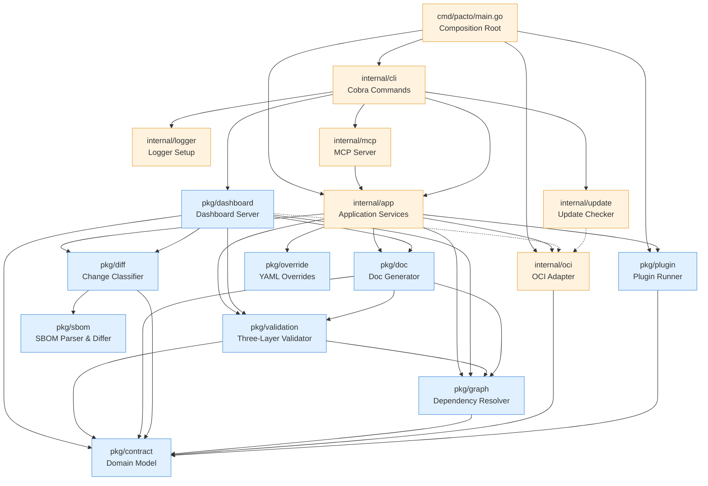
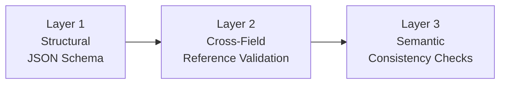

# Architecture
{: .no_toc }

Pacto follows a layered architecture where dependencies flow predominantly in one direction. There are small, deliberate exceptions documented below. This page describes the internal design for contributors and plugin authors.

---

  
Table of contents

- TOC
{:toc}

---

## Dependency graph

Dependencies flow **downward only** with one deliberate exception: `pkg/dashboard` imports `internal/oci` (shown as a dashed edge). The dashboard needs OCI resolution and materialization primitives directly — `BundleStore` for pulling bundles and `Resolver` for lazy dependency resolution. This exception is intentional and must not spread to other `pkg/*` packages.

All core domain logic lives in `pkg/` and is reusable outside the CLI — for example, by the [Kubernetes Operator]({{ site.baseurl }}).

---

## Layer overview

The codebase is organized into three layers:

| Layer | Location | Responsibility |
|-------|----------|----------------|
| **Core** | `pkg/` | Pure, reusable domain logic. No CLI deps, no side effects beyond minimal I/O. |
| **Application** | `internal/app` | Use-case orchestration. Each CLI command maps to one service method. Returns structured results (never prints). |
| **Interfaces** | `internal/cli`, `cmd/` | Thin adapters. Flag parsing, output formatting, process bootstrap. Zero business logic. |

Infrastructure adapters live in `internal/` because they depend on external systems or framework-specific details:

| Package | Role |
|---------|------|
| `internal/oci` | OCI registry client, caching, credential resolution, bundle serialization |
| `internal/mcp` | Model Context Protocol server for AI tool integration |
| `internal/logger` | Global `slog` configuration |
| `internal/update` | Async GitHub version checking and self-update |

Test infrastructure lives in `internal/testutil`, which provides shared mocks and fixtures (`MockBundleStore`, `MockPluginRunner`, `TestBundle()`) used across test packages.

`pkg/dashboard` is the largest package in the core layer. Unlike the other `pkg/*` packages (which are focused processing libraries), the dashboard is a self-contained application component: HTTP server, multi-source data aggregation, graph visualization, compliance engine, Kubernetes client, and embedded SPA. Its complexity is justified because it must remain reusable outside the CLI binary (the Kubernetes operator embeds the same dashboard server).

---

## Package responsibilities

### `pkg/contract` -- Domain model

The root public package. Contains pure Go types and logic with **zero I/O and zero framework dependencies**. Imports nothing from the project.

- `Contract`, `ServiceIdentity`, `Interface`, `Runtime`, `State`, `Configuration`, `Policy`, etc.
- `Parse()` -- YAML deserialization
- `OCIReference` -- OCI reference parsing
- `Range` -- Semver constraint evaluation
- `Bundle` -- Contract + file system

### `pkg/validation` -- Validation engine

Three-layer, short-circuit validation:

Each layer short-circuits -- if it produces errors, subsequent layers are skipped.

Also includes **runtime validation** (`ValidateRuntime`) -- a foundational abstraction for comparing a contract's declared state against observed runtime conditions. This is consumed by the [Kubernetes Operator]({{ site.baseurl }}) without introducing platform-specific dependencies into the core library.

### `pkg/diff` -- Change classifier

Compares two contracts and classifies every change using a deterministic rule table. Sub-analyzers handle specific sections:

- `contract.go` -- service identity, scaling
- `runtime.go` -- workload, state, lifecycle, health
- `interfaces.go` -- interface additions/removals/changes, configuration and policy diffing
- `dependency.go` -- dependency list changes
- `openapi.go` -- deep OpenAPI diff (paths, methods, parameters, request bodies, responses)
- `schema.go` -- JSON Schema property-level diff

### `pkg/sbom` -- SBOM parser and differ

Parses SPDX 2.3 and CycloneDX 1.5 SBOM files from the bundle's `sbom/` directory and normalizes them into a unified package model. Provides a diff engine that compares two SBOM documents and reports package-level changes (added, removed, version/license modified).

- `ParseFromFS()` -- scans `sbom/` for recognized extensions, auto-detects format
- `HasSBOM()` -- checks whether a bundle contains recognized SBOM files
- `Diff()` -- compares two SBOM documents and returns changes

The diff engine (`pkg/diff`) calls into this package when both bundles contain SBOMs. Results are reported separately from contract changes and don't affect classification.

### `pkg/graph` -- Dependency resolver

Builds a dependency graph by recursively fetching contracts from OCI registries and local paths. Sibling dependencies at each level are resolved concurrently. Detects cycles and version conflicts.

- `ParseDependencyRef()` -- centralized dependency reference parser (`oci://`, `file://`, bare paths)
- `RenderTree()` / `RenderDiffTree()` -- tree-style rendering with connectors
- `DiffGraphs()` -- structural diff between two dependency graphs

### `pkg/override` -- YAML overrides

Applies value-file and `--set` overrides to raw YAML before parsing. Supports deep merge, dot-separated paths, and array index notation.

### `pkg/doc` -- Documentation generator

Generates rich Markdown documentation from a contract. Reads OpenAPI specs, event contracts, and JSON Schema configuration to produce a comprehensive service document with architecture diagrams, interface tables, and configuration details. Includes an HTTP server for browser-based viewing.

### `pkg/plugin` -- Plugin system

Out-of-process plugin execution via JSON stdin/stdout. Discovers plugin binaries and manages the communication protocol. See the [Plugin Development]({{ site.baseurl }}) guide.

### `pkg/dashboard` -- Dashboard server

The exploration and observability layer of the Pacto system. See [Dashboard architecture](#dashboard-architecture) below for a detailed design description.

### `internal/app` -- Application services

Each CLI command maps to exactly one service method. This layer orchestrates `pkg/*` packages and infrastructure adapters. Methods are stateless: they take an options struct and return a result struct, never printing directly.

- `Init()`, `Validate()`, `Pack()`, `Push()`, `Pull()`
- `Diff()`, `Graph()`, `Explain()`, `Generate()`, `Doc()`
- Shared helpers: `resolveBundle()`, `resolveBundleWithOverrides()`, `loadAndValidateLocal()`

### `internal/cli` -- CLI layer

Cobra command handlers and Viper configuration. **Zero business logic** -- only input parsing, orchestration, and output formatting.

### `internal/oci` -- OCI adapter

Wraps `go-containerregistry` to handle OCI registry operations. Pacto distributes contracts as OCI artifacts -- the same standard behind container images -- so they work with any OCI-compliant registry (GHCR, ECR, ACR, Docker Hub, Harbor) without new infrastructure. Every pushed contract is content-addressed with a digest, making it immutable and verifiable.

Key components:

- **`BundleStore`** interface -- the core abstraction: `Push()`, `Pull()`, `Resolve()`, `ListTags()`
- **`Client`** -- implements `BundleStore` using `go-containerregistry`. Translates between `contract.Bundle` and OCI images (tar.gz layer with metadata labels)
- **`CachedStore`** -- wraps any `BundleStore` with in-memory and disk caching (`~/.cache/pacto/oci/<registry>/<repo>/<tag>/bundle.tar.gz`). Can be disabled at runtime via `--no-cache`
- **`Resolver`** -- lazy version resolution with semver filtering. `Resolve()` pulls bundles in `LocalOnly` or `RemoteAllowed` mode. `FetchAllVersions()` pulls every semver tag to populate the cache. `FilterSemverTags()` selects valid semver tags sorted descending
- **Credential chain** -- `NewKeychain()` tries sources in priority order: explicit flags/env vars, pacto config (`~/.config/pacto/config.json`), `gh` CLI token (GitHub registries), Docker config + credential helpers, cloud auto-detection (ECR/GCR/ACR), anonymous fallback
- **Typed errors** -- `AuthenticationError`, `ArtifactNotFoundError`, `RegistryUnreachableError`, `InvalidRefError`, `InvalidBundleError`, `NoMatchingVersionError`

### `internal/mcp` -- MCP server

Thin adapter layer that exposes Pacto operations as [Model Context Protocol](https://modelcontextprotocol.io) tools. Each MCP tool handler delegates to an `internal/app` service method -- no business logic lives here. The server communicates over stdio and is started via `pacto mcp`. Used by AI tools such as Claude, Cursor, and Copilot.

### `internal/logger` -- Logger setup

Configures Go's standard `log/slog` default logger based on the `--verbose` flag. When verbose mode is enabled, debug-level messages are emitted to stderr; otherwise only warnings and above are shown. Called once during CLI initialization via `PersistentPreRunE` -- all packages use `slog.Debug()` directly with no wrappers.

### `internal/update` -- Update checker

Performs async version checking against the GitHub releases API. Started in a background goroutine during CLI initialization, with a 200ms timeout to avoid blocking. Results are cached on disk for 24 hours (`~/.config/pacto/update-check.json`) to minimize API calls. Suppressed for dev builds and JSON output mode.

---

## Dashboard architecture

The dashboard is complex enough to warrant its own design section. It provides a web-based UI for navigating contracts, dependency graphs, version history, interface details, configuration schemas, and diffs -- aggregated from multiple data sources.

### Public source model

The dashboard exposes exactly **three public source types**:

| Source type | Role | Key type |
|-------------|------|----------|
| `local` | Contract from filesystem | `LocalSource` |
| `oci` | Contract from OCI registry | `OCISource` |
| `k8s` | Runtime enrichment from Kubernetes | `K8sSource` |

There is no `"cache"` source visible to the API or UI. Materialized bundles on disk are an internal implementation detail of the OCI source (see [Internal materialization](#internal-materialization) below).

### Source categories

Sources are divided into two categories with different roles:

**Contract sources** (`local`, `oci`) provide the authoritative service definition -- interfaces, configuration, dependencies, version, owner. Exactly one contract snapshot wins per service. Priority: `local` > `oci` (explicit dev intent wins over registry baseline).

**Runtime source** (`k8s`) enriches the contract with live cluster state -- phase, conditions, endpoints, resources, ports, scaling, insights, checks. Runtime data **never overrides contract content**. The `enrichWithRuntime()` function in `source_resolver.go` enforces this boundary: it copies k8s-specific fields but preserves all contract fields untouched.

### Resolution model

`ResolvedSource` (`source_resolver.go`) is the central aggregation layer. It combines contract and runtime sources into a unified view:

1. **Contract resolution** -- iterates contract sources in priority order (local first, then oci). The first source that has the service wins. This produces one authoritative contract snapshot.
2. **Runtime enrichment** -- if k8s is available and has data for the service, runtime fields are layered on top of the contract snapshot without replacing any contract content.
3. **Service list** -- all sources are queried concurrently. Services are grouped by name across sources, merged using `mergeServiceEntry()`. The `Sources` array on each service lists all source types where that service was found.

`BuildResolvedSource()` constructs the `ResolvedSource` from the map of detected sources, automatically separating contract sources from the runtime source.

### Version history

Version history is merged across sources in a defined order (`resolverVersionSources` in `source_resolver.go`):

1. **k8s** -- PactoRevision CRDs are most authoritative (deployed versions with timestamps)
2. **oci** -- registry tags provide the full version catalog
3. **local** -- current on-disk version

Cache/materialized bundles do not participate as a separate history source at this level. Instead, `OCISource.GetVersions()` internally enriches its bare tag listings with hash, createdAt, and classification from materialized bundles before returning them. This keeps cache as an internal OCI concern, invisible to the resolver.

Versions are deduplicated by version string. When the same version appears in multiple sources, `enrichVersion()` fills empty fields (hash, createdAt, classification, ref) from later sources without overwriting existing values.

### Classification

`ClassifyVersions()` (`version_classify.go`) is a pure derivational function that computes diff classification between consecutive versions. It operates on `BundlePair` structs (tag + parsed bundle) and is independent of any data source.

Classification requires **materialized bundles** -- both the current and previous version must have their contract bundles available locally. If either bundle is missing (not yet fetched from the registry), that version pair is skipped and receives no classification. This is intentional: classification is computed on demand as bundles become available, not assumed.

### Internal materialization

`CacheSource` (`source_cache.go`) reads materialized OCI bundles from the disk cache (`~/.cache/pacto/oci/`). It is **not a public data source** -- it exists solely as an internal backing store for `OCISource`, providing contract hash, classification, and createdAt enrichment from previously pulled bundles.

The flow:

1. `OCISource.SetCache(cs)` wires a `CacheSource` internally
2. `OCISource.GetVersions()` lists tags from the registry (bare version + ref), then enriches each version with hash, createdAt, and classification from the internal cache
3. After resolve or fetch-all-versions operations, `Server.refreshCacheSources()` rescans the disk cache and invalidates the memory cache so new data surfaces immediately
4. If no live OCI registry is configured but cached bundles exist, `ActiveSources()` in `detect.go` maps the `CacheSource` under the `"oci"` key -- the user sees `"oci"` as the source, never `"cache"`

The `createdAt` timestamp from cached bundles reflects **local materialization time** (when the bundle was pulled to disk), not the registry push time. OCI registries do not expose push timestamps via tag listing.

### `--no-cache` semantics

The `--no-cache` flag is a **cold-start mode**, not a fully stateless mode:

- At startup, `DetectSources()` skips `detectCache()` entirely -- no pre-existing cached bundles are scanned or indexed
- OCI pulls during the session still write bundles to disk (via `CachedStore`)
- If the user triggers "Fetch all versions" or lazy dependency resolution, `refreshCacheSources()` creates a `CacheSource` on the fly and wires it into the OCI source for enrichment
- This means `--no-cache` ensures a clean start but allows same-session materialization to enrich the current view

### Graph model

The dashboard builds two graph representations:

**Global graph** (`buildGlobalGraph()`) -- a flat structure with `GraphNodeData` and `GraphEdgeData`, designed for D3.js force-directed visualization. Includes unresolved external dependencies as nodes with `status: "external"`. Edges are typed as `"dependency"` (contract deps) or `"reference"` (config/policy refs).

**Per-service graph** (`buildGraph()`) -- a recursive `DependencyGraph` with `GraphNode` and `GraphEdge`, used for tree visualization of a single service's dependency chain. Includes cycle detection.

Both graphs use **ref-alias mapping** (`buildRefAliases()`) to resolve OCI repository names (e.g., `my-service-pacto`) to contract service names (e.g., `my-service`), based on `imageRef` and `chartRef` fields from the service index.

`computeBlastRadius()` performs BFS on the reverse dependency graph (required deps only) to count how many services would be transitively affected if a given service breaks.

### Server and API

The HTTP server is built on [Huma v2](https://huma.rocks/) with typed I/O structs and automatic OpenAPI 3.1 spec generation. Static files (embedded SPA) and CORS are served on the raw `http.ServeMux`; only API operations go through Huma.

Key API operations:

| Endpoint | Method | Purpose |
|----------|--------|---------|
| `/health` | GET | Health status + version |
| `/metrics` | GET | Service and source counts |
| `/api/services` | GET | Service list with blast radius, compliance, checks |
| `/api/services/{name}` | GET | Full service details |
| `/api/services/{name}/versions` | GET | Version history |
| `/api/services/{name}/sources` | GET | Per-source breakdown |
| `/api/services/{name}/dependents` | GET | Reverse dependency lookup |
| `/api/services/{name}/graph` | GET | Per-service dependency tree |
| `/api/graph` | GET | Global D3-ready dependency graph |
| `/api/diff` | GET | Classified diff between two versions |
| `/api/sources` | GET | Detected source status and discovery state |
| `/api/resolve` | POST | Lazy-resolve a remote dependency |
| `/api/versions` | POST | List registry tags, optionally fetch all |
| `/api/debug/*` | GET | Diagnostics (requires `--diagnostics` flag) |

When running alongside the Kubernetes operator, `EnrichFromK8s()` automatically discovers OCI repositories from CRD `imageRef` fields, enabling full contract bundles, version history, and diffs without explicit `--repo` flags.

---

## Design principles

1. **Pure core** -- `pkg/*` packages have zero CLI/Kubernetes dependencies and are reusable from any Go program
2. **Strict layering** -- CLI → App → Core (`pkg/`) → Domain (`pkg/contract`), with one documented exception (`pkg/dashboard` → `internal/oci`)
3. **Observation separated from validation** -- runtime observation (collecting actual state from Kubernetes, CI, etc.) happens outside `pkg/`; validation against observed state happens inside `pkg/validation`
4. **No global state** -- all instances created in the composition root (`main.go`); the only global is `slog.SetDefault()` configured once at startup
5. **Interface-based** -- engines depend on interfaces (`DataSource`, `BundleStore`, `ContractFetcher`, `Runner`), not concrete implementations
6. **Out-of-process plugins** -- language-agnostic, version-independent
7. **Embedded schemas** -- JSON Schema compiled into the binary
8. **Deterministic validation** -- no configurable rules; same input, same result

---

## Architectural invariants

These rules must be preserved by future changes. Each exists for a specific reason.

| Invariant | Rationale |
|-----------|-----------|
| `pkg/contract` imports nothing from the project | Foundation layer. If it depends on anything above, the entire dependency graph becomes circular. |
| `pkg/*` must not import `internal/cli` or `internal/app` | Core logic must remain reusable outside the CLI (operator, MCP, tests). |
| Only `pkg/dashboard` may import `internal/oci` from `pkg/` | The dashboard needs OCI primitives directly for lazy resolution and materialization. This exception must not spread to other `pkg/*` packages. |
| K8s enriches runtime only, never overrides contract content | Contract is the source of truth for interfaces, config, dependencies, version. K8s provides live state (phase, conditions, endpoints). Mixing them would make the contract unreliable. |
| Cache must never become a public source | Users see three sources: `local`, `oci`, `k8s`. Cache is an internal optimization. Exposing it would create confusion about which "oci" data is authoritative. |
| `resolverVersionSources` must not include `"cache"` | Cache enrichment happens inside `OCISource.GetVersions()`, not at the resolver level. Adding cache to the resolver would double-count versions. |
| Classification requires materialized bundles | `ClassifyVersions()` diffs consecutive bundles. Without both bundles available, no classification is computed. This is correct behavior, not a bug. |
| `--no-cache` skips startup scanning, not same-session materialization | Cold-start mode ensures deterministic initial state. But bundles fetched during the session are still cached and usable, preventing a degraded experience. |
| `internal/app` methods are stateless | Options in, result out. No side effects beyond the operation itself. This makes testing and composition straightforward. |
| Validation is deterministic | No configurable rule sets. Same contract + same schema = same result, always. |
| `CacheSource` labels its output as `"oci"`, never `"cache"` | When cache stands in for OCI (offline fallback), `mergeServiceEntry()` picks up `Source` from the service. Labeling as `"cache"` would leak the internal concept to the UI. |
