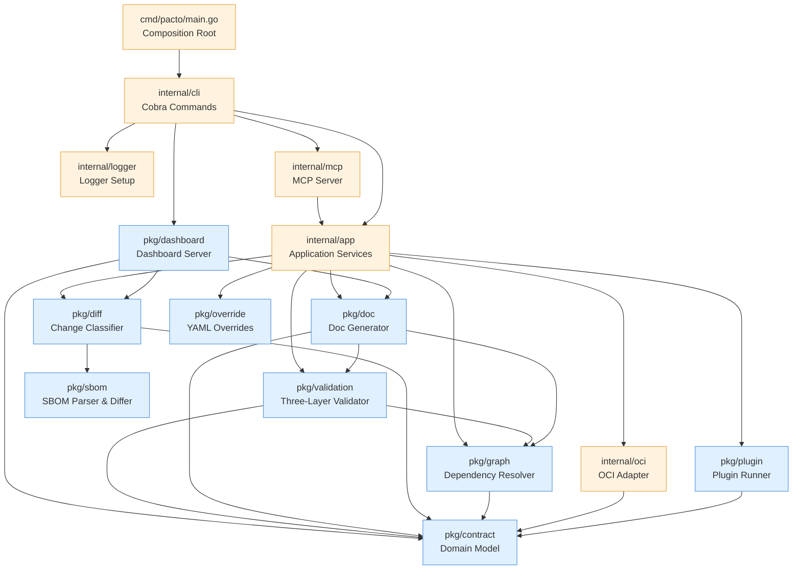
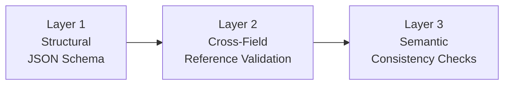

# Architecture
{: .no_toc }

Pacto follows a clean, layered architecture with strict dependency direction. This page describes the internal design for contributors and plugin authors.

---

  
Table of contents

- TOC
{:toc}

---

## Dependency graph

Dependencies flow **downward only**. No package imports a package above it. All core domain logic lives in `pkg/` and is reusable outside the CLI — for example, by the [Kubernetes Operator]({{ site.baseurl }}).

---

## Layer overview

The codebase is organized into three layers:

| Layer | Location | Responsibility |
|-------|----------|----------------|
| **Core** | `pkg/` | Pure, reusable domain logic. No CLI deps, no Kubernetes deps, no side effects beyond minimal I/O. |
| **Application** | `internal/app` | Use-case orchestration. Each CLI command maps to one service method. Returns structured results (never prints). |
| **Interfaces** | `internal/cli`, `cmd/` | Thin adapters. Flag parsing, output formatting, process bootstrap. Zero business logic. |

Infrastructure adapters (`internal/oci`, `internal/mcp`, `internal/logger`, `internal/update`) live in `internal/` because they depend on external systems or framework-specific details.

---

## Package responsibilities

### `pkg/contract` -- Domain model

The root public package. Contains pure Go types and logic with **zero I/O and zero framework dependencies**.

- `Contract`, `ServiceIdentity`, `Interface`, `Runtime`, `State`, `Configuration`, `Policy`, etc.
- `Parse()` -- YAML deserialization
- `OCIReference` -- OCI reference parsing
- `Range` -- Semver constraint evaluation
- `Bundle` -- Contract + file system

### `pkg/validation` -- Validation engine

Three-layer, short-circuit validation:

Each layer short-circuits -- if it produces errors, subsequent layers are skipped.

Also includes **runtime validation** (`ValidateRuntime`) -- a foundational abstraction for comparing a contract's declared state against observed runtime conditions. This is consumed by the [Kubernetes Operator]({{ site.baseurl }}) without introducing platform-specific dependencies into the core library.

### `pkg/diff` -- Change classifier

Compares two contracts and classifies every change using a deterministic rule table. Sub-analyzers handle specific sections:

- `contract.go` -- service identity, scaling
- `runtime.go` -- workload, state, lifecycle, health
- `interfaces.go` -- interface additions/removals/changes, configuration and policy diffing
- `dependency.go` -- dependency list changes
- `openapi.go` -- deep OpenAPI diff (paths, methods, parameters, request bodies, responses)
- `schema.go` -- JSON Schema property-level diff

### `pkg/sbom` -- SBOM parser and differ

Parses SPDX 2.3 and CycloneDX 1.5 SBOM files from the bundle's `sbom/` directory and normalizes them into a unified package model. Provides a diff engine that compares two SBOM documents and reports package-level changes (added, removed, version/license modified).

- `ParseFromFS()` -- scans `sbom/` for recognized extensions, auto-detects format
- `HasSBOM()` -- checks whether a bundle contains recognized SBOM files
- `Diff()` -- compares two SBOM documents and returns changes

The diff engine (`pkg/diff`) calls into this package when both bundles contain SBOMs. Results are reported separately from contract changes and don't affect classification.

### `pkg/graph` -- Dependency resolver

Builds a dependency graph by recursively fetching contracts from OCI registries and local paths. Sibling dependencies at each level are resolved concurrently. Detects cycles and version conflicts.

- `ParseDependencyRef()` -- centralized dependency reference parser (`oci://`, `file://`, bare paths)
- `RenderTree()` / `RenderDiffTree()` -- tree-style rendering with connectors
- `DiffGraphs()` -- structural diff between two dependency graphs

### `pkg/override` -- YAML overrides

Applies value-file and `--set` overrides to raw YAML before parsing. Supports deep merge, dot-separated paths, and array index notation.

### `pkg/doc` -- Documentation generator

Generates rich Markdown documentation from a contract. Reads OpenAPI specs, event contracts, and JSON Schema configuration to produce a comprehensive service document with architecture diagrams, interface tables, and configuration details. Includes an HTTP server for browser-based viewing.

### `pkg/plugin` -- Plugin system

Out-of-process plugin execution via JSON stdin/stdout. Discovers plugin binaries and manages the communication protocol. See the [Plugin Development]({{ site.baseurl }}) guide.

### `pkg/dashboard` -- Dashboard server

Provides a web-based dashboard for visualizing and exploring service contracts. Auto-detects available data sources (Kubernetes, OCI cache, local filesystem) and aggregates them into a unified view.

- Multi-source architecture: `DataSource` interface implemented by `K8sSource`, `CacheSource`, `LocalSource`, `OCISource`
- `AggregatedSource` merges sources with priority: Kubernetes (runtime) > local (contract) > OCI/cache (baseline)
- `CachedDataSource` wraps any source with in-memory TTL caching (source-type-prefixed keys to prevent cross-source collision)
- Phase normalization: `NormalizePhase()` maps non-standard operator phases (e.g. `Reference`, `Progressing`) to the four canonical dashboard phases (`Healthy`, `Degraded`, `Invalid`, `Unknown`)
- Graph building: `buildGlobalGraph()` constructs a flat D3-ready graph from the service index; `buildGraph()` builds a per-service dependency tree. Ref-alias mapping resolves OCI repo names (e.g. `my-service-pacto`) to contract service names (e.g. `my-service`)
- Cross-references: config/policy OCI refs are surfaced as reference edges (dashed lines) distinct from dependency edges (solid lines)
- Embedded SPA with D3.js force-directed graph, source/status/search filtering, service detail pages with tabs (Interfaces, Config, Policy), and diff view
- REST API: `/api/services`, `/api/services/{name}`, `/api/services/{name}/versions`, `/api/services/{name}/sources`, `/api/services/{name}/dependents`, `/api/services/{name}/graph`, `/api/graph`, `/api/diff`, `/api/sources`

### `internal/app` -- Application services

Each CLI command maps to exactly one service method. This layer orchestrates `pkg/*` packages and infrastructure adapters.

- `Init()`, `Validate()`, `Pack()`, `Push()`, `Pull()`
- `Diff()`, `Graph()`, `Explain()`, `Generate()`, `Doc()`
- Shared helpers: `resolveBundle()`, `loadAndValidateLocal()`

### `internal/cli` -- CLI layer

Cobra command handlers and Viper configuration. **Zero business logic** -- only input parsing, orchestration, and output formatting.

### `internal/oci` -- OCI adapter

Thin wrapper over `go-containerregistry`. Handles bundle-to-image translation, credential resolution, error mapping, and local disk caching of pulled bundles (`~/.cache/pacto/oci/`).

Pacto distributes contracts as OCI artifacts -- the same standard behind container images. This means contracts work with any OCI-compliant registry (GHCR, ECR, ACR, Docker Hub, Harbor) without new infrastructure. Every pushed contract is content-addressed with a digest, making it immutable and verifiable.

### `internal/mcp` -- MCP server

Thin adapter layer that exposes Pacto operations as [Model Context Protocol](https://modelcontextprotocol.io) tools. Each MCP tool handler delegates to an `internal/app` service method -- no business logic lives here. The server communicates over stdio and is started via `pacto mcp`. Used by AI tools such as Claude, Cursor, and Copilot.

### `internal/logger` -- Logger setup

Configures Go's standard `log/slog` default logger based on the `--verbose` flag. When verbose mode is enabled, debug-level messages are emitted to stderr; otherwise only warnings and above are shown. Called once during CLI initialization via `PersistentPreRunE` -- all packages use `slog.Debug()` directly with no wrappers.

---

## Design principles

1. **Pure core** -- `pkg/*` packages have zero CLI/Kubernetes dependencies and are reusable from any Go program
2. **Strict layering** -- CLI -> App -> Core (`pkg/`) -> Domain (`pkg/contract`)
3. **Observation separated from validation** -- runtime observation (collecting actual state from Kubernetes, CI, etc.) happens outside `pkg/`; validation against observed state happens inside `pkg/validation`
4. **No global state** -- all instances created in the composition root (`main.go`); the only global is `slog.SetDefault()` configured once at startup
5. **Interface-based** -- engines depend on interfaces, not concrete implementations
6. **Out-of-process plugins** -- language-agnostic, version-independent
7. **Embedded schemas** -- JSON Schema compiled into the binary
8. **Deterministic validation** -- no configurable rules; same input, same result
