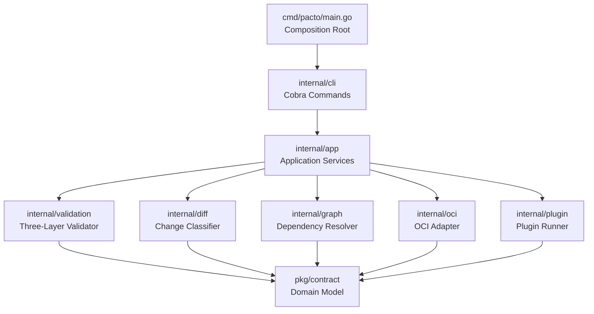
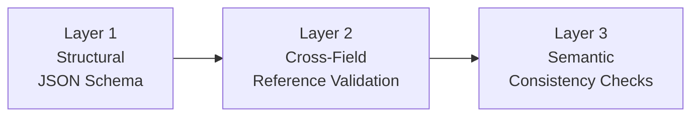

# Architecture

Pacto follows a clean, layered architecture with strict dependency direction. This page describes the internal design for contributors and plugin authors.

---

## Dependency graph

Dependencies flow **downward only**. No package imports a package above it.

---

## Package responsibilities

### `pkg/contract` — Domain model

The only public package. Contains pure Go types and logic with **zero I/O and zero framework dependencies**.

- `Contract`, `ServiceIdentity`, `Interface`, `Runtime`, `State`, etc.
- `Parse()` — YAML deserialization
- `OCIReference` — OCI reference parsing
- `Range` — Semver constraint evaluation
- `Bundle` — Contract + file system

### `internal/app` — Application services

Each CLI command maps to exactly one service method. This layer orchestrates domain logic and infrastructure.

- `Init()`, `Validate()`, `Pack()`, `Push()`, `Pull()`
- `Diff()`, `Graph()`, `Explain()`, `Generate()`
- Shared helpers: `resolveBundle()`, `loadAndValidateLocal()`

### `internal/cli` — CLI layer

Cobra command handlers and Viper configuration. **Zero business logic** — only input parsing, orchestration, and output formatting.

### `internal/validation` — Validation engine

Three-layer, short-circuit validation:

Each layer short-circuits — if it produces errors, subsequent layers are skipped.

### `internal/diff` — Change classifier

Compares two contracts and classifies every change using a deterministic rule table. Sub-analyzers handle specific sections:

- `contract.go` — service identity, scaling
- `runtime.go` — workload, state, lifecycle, health
- `interfaces.go` — interface additions/removals/changes
- `dependency.go` — dependency list changes
- `openapi.go` — OpenAPI path-level diff
- `schema.go` — JSON Schema property-level diff

### `internal/graph` — Dependency resolver

Builds a dependency graph by recursively fetching contracts from OCI registries. Detects cycles and version conflicts.

### `internal/oci` — OCI adapter

Thin wrapper over `go-containerregistry`. Handles bundle-to-image translation, credential resolution, and error mapping.

### `internal/plugin` — Plugin system

Out-of-process plugin execution via JSON stdin/stdout. Discovers plugin binaries and manages the communication protocol.

---

## Design principles

1. **Pure core** — `pkg/contract` has zero I/O and zero framework dependencies
2. **Strict layering** — CLI → App → Engines → Domain
3. **No global state** — all instances created in the composition root (`main.go`)
4. **Interface-based** — engines depend on interfaces, not concrete implementations
5. **Out-of-process plugins** — language-agnostic, version-independent
6. **Embedded schemas** — JSON Schema compiled into the binary
7. **Deterministic validation** — no configurable rules; same input, same result
