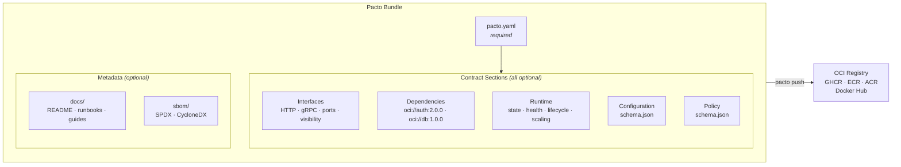

# Pacto
{: .no_toc }

**A single YAML contract that describes how a cloud-native service behaves — validated, versioned, and distributed as an OCI artifact.**
{: .fs-5 .fw-300 }

[Get Started]({{ site.baseurl }}){: .btn .btn-primary .fs-5 .mb-4 .mb-md-0 .mr-2 }
[Specification]({{ site.baseurl }}){: .btn .fs-5 .mb-4 .mb-md-0 .mr-2 }
[Examples]({{ site.baseurl }}){: .btn .fs-5 .mb-4 .mb-md-0 .mr-2 }
[Demo](https://github.com/TrianaLab/pacto-demo){: .btn .fs-5 .mb-4 .mb-md-0 }

---

<details open markdown="block">
  <summary>Table of contents</summary>
- TOC
{:toc}
</details>

---

## What is Pacto?

Pacto (/ˈpak.to/ — Spanish for *pact*) captures everything a platform needs to know about a service — interfaces, runtime behavior, dependencies, configuration, and scaling — in one YAML file that machines can validate and tooling can consume.

Pacto is a **runtime contract system** made of three complementary pieces:

- **CLI** — author, validate, diff, explain, and publish contracts
- **Dashboard** — explore contracts, dependency graphs, versions, and diffs visually
- **Kubernetes Operator** — verify that live runtime remains faithful to the contract

No runtime agents. No sidecars. No new infrastructure. The CLI runs at build time and CI time. The dashboard and operator extend the same contracts into exploration and runtime verification — without duplicating logic or adding moving parts.

---

## AI-native contracts

Pacto contracts are machine-readable by design. Beyond platforms and CI pipelines, they can be consumed directly by AI assistants through the [Model Context Protocol](https://modelcontextprotocol.io). Running `pacto mcp` starts an MCP server that exposes contract-aware tools — allowing assistants like Claude, Cursor, and GitHub Copilot to validate contracts, inspect dependency graphs, generate new contracts, and explain breaking changes. See the [MCP Integration]({{ site.baseurl }}) guide.

---

## The problem

Today, a cloud service is described across **six different places** — none of which talk to each other:

```
OpenAPI spec    → describes the API, but not the runtime
Helm values     → describes deployment, but not the service
env vars        → documented in a wiki (maybe), validated never
K8s manifests   → hardcoded ports, guessed health checks
Dependencies    → tribal knowledge in Slack threads
README.md       → outdated the day it was written
```

The consequences:

- **Platforms guess service behavior.** *Is it stateful? What port? Does it need persistent storage?*
- **Dev ↔ Platform friction.** Developers ship code; platform engineers reverse-engineer how to run it.
- **Breaking changes detected too late.** A port change or removed dependency breaks production, not CI.
- **No dependency visibility.** No one knows what depends on what until something breaks.

---

## The solution: one operational contract

Pacto replaces the six fragmented sources with a single source of truth:

```yaml
pactoVersion: "1.0"

service:
  name: payments-api
  version: 2.1.0
  owner: team/payments

interfaces:
  - name: rest-api
    type: http
    port: 8080
    visibility: public
    contract: interfaces/openapi.yaml

dependencies:
  - name: auth
    ref: oci://ghcr.io/acme/auth-pacto@sha256:abc123
    required: true
    compatibility: "^2.0.0"

runtime:
  workload: service
  state:
    type: stateful
    persistence:
      scope: local
      durability: persistent
    dataCriticality: high
  health:
    interface: rest-api
    path: /health

scaling:
  min: 2
  max: 10
```

Every question a platform could ask — *What port? Stateful or stateless? What does it depend on? How should it scale?* — is answered in one file, validated by tooling, and versioned in a registry.

Only `pactoVersion` and `service` are required — everything else is opt-in, so a contract can be as minimal or as detailed as your service needs.

---

## When should I use Pacto?

Pacto helps when operational knowledge about services is scattered, implicit, or outdated. These are the situations where it adds the most value:

### You manage many services and can't keep track of what each one needs

Platform teams supporting 10+ services often discover runtime requirements the hard way — in production. Pacto makes every service self-describing: workload type, state model, health checks, scaling, and dependencies are declared up front, not reverse-engineered from Helm charts.

### Runtime assumptions are buried in deployment configs

When a Helm chart says `replicas: 3` and `volumeClaimTemplates: [...]`, it implies a stateful service — but it never says it explicitly. Pacto separates *what the service is* from *how it's deployed*, so platforms can reason about behavior without reading deployment templates.

### Services have undocumented dependencies

A payment service calls auth, which calls user-store, which needs a database. Nobody wrote this down. With Pacto, dependencies are declared in the contract, resolved from OCI registries, and visualized as a graph. When you upgrade auth, `pacto diff` tells you the full blast radius.

### Your CI pipeline can't detect operational breaking changes

Code-level tests pass, but a port number changed, a health endpoint was removed, or a service switched from stateless to stateful. These are operational breaking changes that CI doesn't catch — unless contracts are validated and diffed as part of the pipeline.

### Onboarding a new service takes too long

Instead of filing tickets, attending meetings, and writing wiki pages, a developer runs `pacto init`, fills in the contract, and pushes it. The platform knows everything it needs to provision the service.

---

## How it works — 30 seconds

```
1. Developer writes a pacto.yaml alongside their code
2. pacto validate checks it (structure, cross-references, semantics)
3. pacto push ships the contract to an OCI registry as a versioned artifact
4. pacto dashboard explores contracts, graphs, versions, and diffs visually
5. The Kubernetes operator verifies runtime stays faithful to the contract
```

The real value of Pacto appears across the full loop: **author → validate → publish → explore → verify at runtime**. Each piece has a clear responsibility — the CLI manages the contract lifecycle, the dashboard makes contracts observable, and the operator closes the gap between declaration and reality.

---

## What's inside a Pacto bundle



A bundle is a self-contained directory (or OCI artifact) containing:

- **`pacto.yaml`** — the contract: interfaces, dependencies, runtime semantics, scaling *(required)*
- **`interfaces/`** *(optional)* — OpenAPI specs, protobuf definitions, event schemas
- **`configuration/`** *(optional)* — JSON Schema for environment variables and settings
- **`policy/`** *(optional)* — JSON Schema that validates the contract itself (organizational standards enforcement)
- **`docs/`** *(optional)* — service documentation (README, runbooks, architecture notes)
- **`sbom/`** *(optional)* — Software Bill of Materials in [SPDX](https://spdx.dev/) or [CycloneDX](https://cyclonedx.org/) format. `pacto diff` reports package-level changes when present

Only `pacto.yaml` is required. All other directories are optional — include them when your contract references files in them. Validation enforces that every referenced file exists within the bundle.

---

## Key capabilities

- **4-layer validation** — structural (JSON Schema), cross-field (port references, interface names), semantic (state vs. persistence consistency), and policy enforcement
- **Breaking change detection** — `pacto diff` compares two contract versions field-by-field *and* resolves both dependency trees to show the full blast radius
- **Dependency graph resolution** — recursively resolve transitive dependencies from OCI registries; sibling deps are fetched in parallel
- **OCI distribution** — push/pull contracts to any OCI registry (GHCR, ECR, ACR, Docker Hub, Harbor); bundles are cached locally for fast repeated operations
- **Plugin-based generation** — `pacto generate` invokes out-of-process plugins to produce deployment artifacts from a contract
- **Rich documentation** — `pacto doc` generates Markdown with architecture diagrams, interface tables, and configuration details
- **SBOM diffing** — optional SPDX or CycloneDX SBOM inclusion with automatic package-level change detection on `pacto diff`
- **Contract exploration dashboard** — `pacto dashboard` launches a web UI for navigating contracts, dependency graphs, version history, interface details, configuration schemas, and diffs across local, OCI, and Kubernetes sources
- **Runtime fidelity verification** — the optional [Kubernetes Operator]({{ site.baseurl }}) continuously checks that deployed services match their contracts — port alignment, workload existence, health endpoint reachability, and more
- **AI assistant integration** — `pacto mcp` exposes all contract operations as [MCP](https://modelcontextprotocol.io) tools for Claude, Cursor, and GitHub Copilot

---

## See it in action

### Detect breaking changes — with full dependency graph diff

```bash
$ pacto diff oci://ghcr.io/acme/payments-api-pacto:1.0.0 \
             oci://ghcr.io/acme/payments-api-pacto:2.0.0
Classification: BREAKING
Changes (4):
  [BREAKING] runtime.state.type (modified): runtime.state.type modified [stateless -> stateful]
  [BREAKING] runtime.state.persistence.durability (modified): ... [ephemeral -> persistent]
  [BREAKING] interfaces (removed): interfaces removed [- metrics]
  [BREAKING] dependencies (removed): dependencies removed [- redis]

Dependency graph changes:
payments-api
├─ auth-service  1.5.0 → 2.3.0
└─ postgres      -16.0.0
```

Version upgrades, added services, removed dependencies — all visible in one command. Use the exit code in CI to gate deployments.

### Visualize the full dependency tree

```bash
$ pacto graph oci://ghcr.io/acme/api-gateway:2.0.0
api-gateway@2.0.0
├─ auth-service@2.3.0
│  └─ user-store@1.0.0
└─ payments-api@1.0.0
   └─ postgres@16.0.0
```

---

## Who is Pacto for?

### Developers

Define your service's operational interface alongside your code. Declare interfaces, configuration schema, health checks, and dependencies. Validate locally before pushing. [Learn more]({{ site.baseurl }})

### Platform engineers

Consume contracts to generate deployment manifests, enforce policies, detect breaking changes, and build dependency graphs — deterministically and automatically. [Learn more]({{ site.baseurl }})

---

## What Pacto is not

- **Not a deployment tool** — it describes *what* to deploy, not *how*
- **Not a generic policy engine** — policies validate contract structure, not arbitrary infrastructure rules
- **Not just a Kubernetes linter** — the operator is one part of the system, not the whole product
- **Not a registry** — it uses existing OCI registries (GHCR, ECR, ACR, Docker Hub)
- **Not a service mesh or runtime agent** — no sidecars, no proxies; the operator watches CRDs, not traffic
- **Not a replacement for Helm or Terraform** — it complements them as input
- **Not a service catalog** — it produces the structured data that a catalog (Backstage, Port, Cortex) could consume

Pacto is a **runtime contract system**. The CLI manages contracts. The dashboard makes them explorable. The operator verifies them at runtime. Together, they tell platforms, pipelines, and AI agents what a service *is* — and whether it still matches what was declared.
