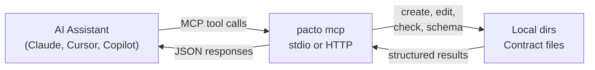

# MCP Integration
{: .no_toc }

Pacto includes a built-in [Model Context Protocol](https://modelcontextprotocol.io) (MCP) server that exposes contract operations as tools for AI assistants. This enables AI tools like Claude, Cursor, and GitHub Copilot to create, edit, and validate Pacto contracts directly.

---

<details open markdown="block">
  <summary>Table of contents</summary>
- TOC
{:toc}
</details>

---

## Why MCP?

[MCP](https://modelcontextprotocol.io) (Model Context Protocol) is an open standard that lets AI tools call external functions through structured tool calls — similar to how a browser calls an API, but designed for LLMs. Instead of pasting CLI output into a chat window, the assistant calls `pacto_create` or `pacto_check` directly and gets structured JSON back.

This matters because Pacto contracts are already machine-readable. MCP turns that into a two-way interaction: the assistant doesn't just *read* contracts — it can create new ones from intent-level descriptions, edit existing ones, and validate them, all within a single conversation.

---

## How it works



An AI assistant sends MCP tool calls to the `pacto mcp` server. Pacto executes the operation against local contract directories and returns structured JSON results. The assistant works entirely through the tool interface — no direct file access needed.

---

## Available tools

| Tool | Description |
|------|-------------|
| `pacto_create` | Create a new contract from intent-level inputs (name, description, interfaces, runtime semantics). Supports dry run. |
| `pacto_edit` | Edit an existing contract — add/remove interfaces and dependencies, change runtime, update metadata. Supports dry run. |
| `pacto_check` | Validate a contract and return errors, warnings, and actionable improvement suggestions. |
| `pacto_schema` | Return the Pacto format explanation and full JSON Schema reference. Call this first if the assistant needs schema details. |

### pacto_create

Creates a new Pacto contract from structured input. The tool infers contract details from a natural-language description and explicit parameters.

**Key inputs:**
- `name` (required) — service name
- `description` — natural-language description (triggers automatic inference of interfaces, dependencies, and runtime)
- `interfaces` — JSON array of `{name, type, port}` objects
- `stores_data`, `data_survives_restart`, `data_shared_across_instances` — intent-level runtime flags mapped to contract primitives
- `dry_run` — validate and return the result without writing files

**Description inference:** When a description mentions terms like "REST API", "gRPC", "PostgreSQL", or "Kafka", the tool automatically infers interfaces, dependencies, and runtime configuration. Explicit inputs always override inferred values.

**Runtime mapping:** Intent-level flags are deterministically mapped to contract primitives:

| Intent | Contract field |
|--------|---------------|
| `stores_data=true` + `data_survives_restart=false` | `state.type: ephemeral`, `persistence.durability: ephemeral` |
| `stores_data=true` + `data_survives_restart=true` | `state.type: stateful`, `persistence.durability: persistent` |
| `data_shared_across_instances=true` | `persistence.scope: shared` |
| `data_loss_impact=high` | `dataCriticality: high` |

### pacto_edit

Modifies an existing contract. Reads the current `pacto.yaml`, applies changes, validates the result, and writes back atomically.

**Key inputs:**
- `path` — directory containing `pacto.yaml` (defaults to `.`)
- `add_interfaces` / `remove_interfaces` — add or remove interfaces
- `add_dependencies` / `remove_dependencies` — add or remove dependencies
- Runtime flags (`stores_data`, `data_survives_restart`, etc.)
- `dry_run` — validate without writing

### pacto_check

Validates a contract and returns structured results including errors, warnings, a contract summary, and actionable suggestions for improvement.

**Output includes:**
- `valid` — whether the contract passes validation
- `errors` / `warnings` — validation issues with path, code, and message
- `summary` — parsed contract overview (name, version, interfaces, runtime state)
- `suggestions` — actionable improvements with tool call references (e.g., "add a health interface" with the exact `pacto_edit` call to do it)

### pacto_schema

Returns the Pacto format description and the full JSON Schema for `pacto.yaml`. Useful as a first call so the assistant understands the contract structure before creating or editing.

---

## Transports

Pacto supports two MCP transports:

| Transport | Flag | Use case |
|-----------|------|----------|
| **stdio** (default) | `pacto mcp` | Direct integration with CLI-based AI tools (Claude Code, Cursor) |
| **HTTP** | `pacto mcp -t http` | Network-accessible server for web-based or remote AI tools |

The HTTP transport serves the [Streamable HTTP](https://modelcontextprotocol.io/specification/2025-03-26/basic/transports#streamable-http) protocol at the `/mcp` endpoint. The port defaults to `8585` and can be changed with `--port`.

---

## Claude integration

### Claude Code (CLI)

Add Pacto as an MCP server in your project's `.mcp.json` file:

```json
{
  "mcpServers": {
    "pacto": {
      "command": "pacto",
      "args": ["mcp"]
    }
  }
}
```

Claude Code uses stdio transport — no port configuration needed. Once configured, Claude can create contracts, edit them, and validate changes directly from your conversation.

### Claude Desktop

Add the server to your `claude_desktop_config.json`:

```json
{
  "mcpServers": {
    "pacto": {
      "command": "pacto",
      "args": ["mcp"]
    }
  }
}
```

{: .tip }
The config file is located at `~/Library/Application Support/Claude/claude_desktop_config.json` on macOS or `%APPDATA%\Claude\claude_desktop_config.json` on Windows.

### Example prompts

Once connected, you can interact with contracts conversationally:

```
You:    Create a pacto contract for a stateful Go HTTP API called user-service
        that stores data in PostgreSQL
Claude: [creates pacto.yaml with HTTP interface, postgres dependency,
         stateful runtime, and persistent storage]

You:    Check the contract in ./payments-api
Claude: payments-api is valid. Suggestions: add a health interface,
        consider adding scaling configuration.

You:    Add a gRPC interface called "internal-api" on port 9090
        to the payments-api contract
Claude: [edits pacto.yaml, adds gRPC interface, validates result]

You:    What's the Pacto schema format?
Claude: [returns full JSON Schema and format description]
```

---

## Cursor

Add Pacto as an MCP server in your Cursor settings (`.cursor/mcp.json`):

```json
{
  "mcpServers": {
    "pacto": {
      "command": "pacto",
      "args": ["mcp"]
    }
  }
}
```

---

## GitHub Copilot

### VS Code

Add Pacto as an MCP server in your VS Code settings (`.vscode/settings.json`):

```json
{
  "mcp": {
    "servers": {
      "pacto": {
        "command": "pacto",
        "args": ["mcp"]
      }
    }
  }
}
```

Alternatively, create a `.vscode/mcp.json` file in your project root:

```json
{
  "servers": {
    "pacto": {
      "command": "pacto",
      "args": ["mcp"]
    }
  }
}
```

Once configured, Copilot Chat in agent mode can use Pacto tools. Try asking: *"@workspace create a pacto contract for my-service"*.

{: .note }
MCP support in GitHub Copilot requires VS Code 1.99+ and the GitHub Copilot Chat extension.

---

## HTTP transport

For tools that connect over HTTP rather than stdio, start the server with:

```bash
# Default port (8585)
pacto mcp -t http

# Custom port
pacto mcp -t http --port 9090
```

The server listens on `127.0.0.1` and serves the MCP Streamable HTTP protocol at `/mcp`. Connect your MCP client to `http://127.0.0.1:8585/mcp` (or your chosen port).

---

## Troubleshooting

**Tools not showing up in your AI assistant?**

1. Verify Pacto is installed and in your `PATH`:
   ```bash
   pacto version
   ```

2. Test the MCP server directly:
   ```bash
   pacto mcp --help
   ```

3. Check your MCP configuration file for JSON syntax errors.

4. Use verbose mode to see debug output:
   ```bash
   pacto mcp -v
   ```
