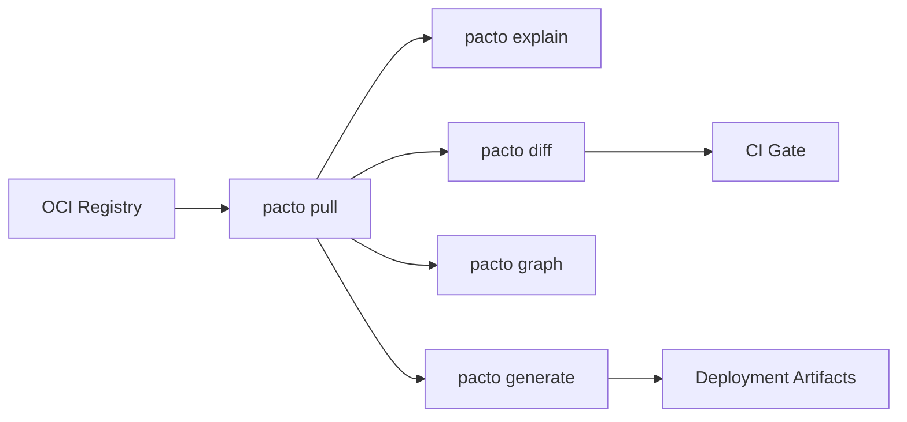

# Pacto for Platform Engineers
{: .no_toc }

You manage the infrastructure that runs services. Pacto gives you a machine-readable, validated contract for every service — so you can stop guessing and start automating.

Instead of reverse-engineering how to run a service from Helm charts, READMEs, and Slack threads, you pull a contract from an OCI registry and get everything you need: workload type, state model, interfaces, health checks, dependencies, configuration schema, and scaling intent.

---

<details open markdown="block">
  <summary>Table of contents</summary>
- TOC
{:toc}
</details>

---

## What a contract tells you

Every question you'd normally have to ask the dev team — or discover in production — is answered in the contract:

| Contract Field | Platform Decision |
|---|---|
| `runtime.workload: service` | Deploy as a long-running process (Deployment/StatefulSet) |
| `runtime.workload: job` | Deploy as a one-shot task (Job/CronJob) |
| `runtime.state.type: stateful` | Needs stable identity and storage (StatefulSet + PVC) |
| `runtime.state.type: stateless` | Horizontally scalable, no persistent storage needed |
| `runtime.state.persistence.durability: persistent` | Provision durable storage |
| `runtime.state.dataCriticality: high` | Enable backups, stricter disruption budgets |
| `interfaces[].port` | Configure Service, Ingress |
| `interfaces[].visibility: public` | Create external Ingress or load balancer |
| `runtime.health.interface` + `runtime.health.path` | Configure liveness/readiness probes |
| `runtime.lifecycle.upgradeStrategy: ordered` | Use ordered pod management |
| `runtime.lifecycle.gracefulShutdownSeconds` | Set termination grace period |
| `scaling.min` / `scaling.max` | Configure auto-scaling bounds |
| `configuration.schema` / `configuration.configs[].ref` | Validate required configuration, generate config templates. Platform teams can publish a shared schema that services vendor into their bundles or reference via OCI — the schema then expresses what the platform *provides*. See [Configuration Schema Ownership Models]({{ site.baseurl }}#configuration-schema-ownership-models) |
| `policies[].ref` | Enforce organizational standards — require health endpoints, mandate ports, enforce visibility rules. See [policies]({{ site.baseurl }}#policies) |
| `dependencies[].ref` | Validate dependency graph, check compatibility |
| `docs/` *(optional)* | Access service documentation, runbooks, integration guides |
| `sbom/` *(optional)* | Audit third-party packages, track license compliance |

---

## Your workflow



### 1. Pull a service contract

```bash
pacto pull oci://ghcr.io/acme/payments-api-pacto:2.1.0
```

### 2. Inspect it

```bash
$ pacto explain oci://ghcr.io/acme/payments-api-pacto:2.1.0
Service: payments-api@2.1.0
Owner: team/payments
Pacto Version: 1.0

Runtime:
  Workload: service
  State: stateful
  Persistence: local/persistent
  Data Criticality: high

Interfaces (2):
  - rest-api (http, port 8080, public)
  - grpc-api (grpc, port 9090, internal)

Dependencies (1):
  - oci://ghcr.io/acme/auth-pacto@sha256:abc123 (^2.0.0, required)

Scaling: 2-10
```

### 3. Check for breaking changes

```bash
pacto diff \
  oci://ghcr.io/acme/payments-api-pacto:2.0.0 \
  oci://ghcr.io/acme/payments-api-pacto:2.1.0
```

`pacto diff` exits non-zero if breaking changes are detected. Use the exit code in CI to gate deployments.

### 4. Resolve the dependency graph

```bash
$ pacto graph oci://ghcr.io/acme/payments-api-pacto:2.1.0
payments-api@2.1.0
├─ auth-service@2.3.0
│  └─ user-store@1.0.0
└─ notifications@1.0.0 (shared)
```

Dependencies are resolved recursively from OCI registries. Sibling deps are fetched in parallel. Results are cached locally for fast repeated lookups.

#### Including config/policy references

By default, `pacto graph` shows only declared `dependencies`. To also visualize **config/policy references** — OCI refs in the `configuration.configs[].ref` and `policies[].ref` fields — use the reference flags:

```bash
# Show dependencies AND config/policy references
pacto graph --with-references oci://ghcr.io/acme/payments-api-pacto:2.1.0

# Show ONLY config/policy references (no dependencies)
pacto graph --only-references oci://ghcr.io/acme/payments-api-pacto:2.1.0
```

References differ from dependencies: a **dependency** declares a runtime relationship between services (`dependencies[].ref`), while a **reference** points to a shared configuration or policy contract (`configuration.ref` / `configuration.configs[].ref` or `policies[].ref`). Both produce graph edges, but references are rendered with dashed lines in the dashboard graph.

### 5. Generate deployment artifacts

```bash
pacto generate helm oci://ghcr.io/acme/payments-api-pacto:2.1.0
```

This invokes the `pacto-plugin-helm` plugin to produce Helm charts, Kubernetes manifests, or whatever your plugin generates. See the [Plugin Development]({{ site.baseurl }}) guide.

---

## Mapping contracts to infrastructure

### Workload type

| `runtime.workload` | Kubernetes resource | Notes |
|---|---|---|
| `service` | Deployment or StatefulSet | Based on `runtime.state.type` |
| `job` | Job | No scaling, runs to completion |
| `scheduled` | CronJob | Schedule defined externally |

### State model

The state model tells you exactly what storage and scheduling strategy a service needs:

| `runtime.state.type` | `runtime.state.persistence` | Infrastructure |
|---|---|---|
| `stateless` | `local/ephemeral` | Deployment, no PVC, free to scale horizontally |
| `stateful` | `local/persistent` | StatefulSet + PVC, stable identity per replica |
| `stateful` | `local/ephemeral` | StatefulSet with emptyDir (stable identity, no durable storage) |
| `stateful` | `shared/persistent` | Network-attached or shared storage |
| `hybrid` | `local/persistent` | StatefulSet + PVC, tolerates cold starts |
| `hybrid` | `local/ephemeral` | Deployment with emptyDir, warm caches improve performance |

### Upgrade strategy

| `runtime.lifecycle.upgradeStrategy` | Kubernetes strategy |
|---|---|
| `rolling` | `RollingUpdate` |
| `recreate` | `Recreate` |
| `ordered` | StatefulSet with `OrderedReady` |

---

## Configuration and policy

Two features give platform teams direct control over the boundary between developers and infrastructure: **configuration schemas** and **policies**. Both can be centralized via OCI references, making them a cornerstone of the platform-as-a-product model.

### Configuration: the interface between dev and platform

The `configuration` section defines **the interface boundary between a service and its environment**. When a platform team publishes a shared configuration schema, it declares *what the platform provides* — database connections, observability endpoints, feature flags, secret paths. When a service author defines one, it declares *what the service requires*.

There are two approaches:

**Vendored:** The platform publishes a schema externally, and services copy it into their bundle at build time:

```yaml
configuration:
  schema: configuration/platform-schema.json
```

**Referenced (OCI):** Services reference the platform's configuration contract directly. No vendoring required — Pacto resolves the schema from the referenced bundle at the fixed path `configuration/schema.json`:

```yaml
configuration:
  ref: oci://ghcr.io/acme/platform-config-pacto:1.0.0
```

The OCI approach enables centralized configuration management: the platform team publishes one configuration contract, all services reference it, and updates propagate through version bumps — not copy-pasting files.

See [Configuration Schema Ownership Models]({{ site.baseurl }}#configuration-schema-ownership-models) for the full breakdown of service-defined vs. platform-defined schemas.

### Policy: enforcing contract standards

The `policies` section lets platform teams enforce **minimum requirements on contracts themselves**. A policy is a JSON Schema that validates `pacto.yaml` — requiring health endpoints, mandating specific ports, enforcing visibility rules, or any other organizational standard.

**How it works:**

1. The platform team creates a policy contract containing a JSON Schema at `policy/schema.json`:

```yaml
# platform-policy/pacto.yaml
pactoVersion: "1.0"
service:
  name: platform-policy
  version: 1.0.0
  owner: team/platform
policies:
  - schema: policy/schema.json
```

2. The platform publishes it: `pacto push oci://ghcr.io/acme/platform-policy-pacto -p platform-policy`

3. Services adopt the policy by referencing it:

```yaml
policies:
  - ref: oci://ghcr.io/acme/platform-policy-pacto:1.0.0
```

Example policy schema (`policy/schema.json`) requiring all contracts to have a health check:

```json
{
  "$schema": "https://json-schema.org/draft/2020-12/schema",
  "type": "object",
  "required": ["runtime"],
  "properties": {
    "runtime": {
      "type": "object",
      "required": ["health"],
      "properties": {
        "health": {
          "type": "object",
          "required": ["interface", "path"]
        }
      }
    }
  }
}
```

Policy references support recursive resolution — if the referenced contract itself has a `policies[].ref`, Pacto follows the chain with cycle detection.

See [policies]({{ site.baseurl }}#policies) in the Contract Reference for the full specification.

{: .important }
> Configuration and policy are complementary:
>
> - **Configuration** defines what a service needs (or what the platform provides) — the *data interface*
> - **Policy** enforces how contracts must be structured — the *contract interface*
>
> Together, they give platform teams a centralized, versioned, machine-validated governance model — without tickets, wikis, or manual review.

---

## Breaking change detection

`pacto diff` doesn't just compare contract fields — it performs deep OpenAPI diffing (paths, methods, parameters, request bodies, responses) and resolves both dependency trees to show the full blast radius.

```bash
$ pacto diff oci://ghcr.io/acme/payments-api-pacto:1.0.0 \
             oci://ghcr.io/acme/payments-api-pacto:2.0.0
Classification: BREAKING
Changes (4):
  [BREAKING] runtime.state.type (modified): runtime.state.type modified [stateless -> stateful]
  [BREAKING] runtime.state.persistence.durability (modified): ... [ephemeral -> persistent]
  [BREAKING] interfaces (removed): interfaces removed [- metrics]
  [BREAKING] dependencies (removed): dependencies removed [- redis]

Dependency graph changes:
payments-api
├─ auth-service  1.5.0 → 2.3.0
└─ postgres      -16.0.0
```

Every change is classified as `NON_BREAKING`, `POTENTIAL_BREAKING`, or `BREAKING`. See the [Change Classification Rules]({{ site.baseurl }}#change-classification-rules) for the full table.

When both bundles include an `sbom/` directory, `pacto diff` also reports SBOM package-level changes (added, removed, version or license modified). These are informational and don't affect the classification or exit code.

---

## CI integration

Use Pacto in CI pipelines to catch problems before deployment:

```yaml
# Example CI pipeline
steps:
  - name: Infer config schema from sample config
    run: pacto generate schema-infer . --option file=config.yaml -o .

  - name: Infer OpenAPI spec from source code
    run: pacto generate openapi-infer . -o .

  - name: Validate contract
    run: pacto validate .

  - name: Check for breaking changes
    run: pacto diff oci://ghcr.io/acme/my-service-pacto:latest .

  - name: Post diff as PR comment (markdown)
    run: |
      DIFF=$(pacto diff --output-format markdown oci://ghcr.io/acme/my-service-pacto:latest . 2>&1 || true)
      gh pr comment --body "$DIFF"

  - name: Verify dependency graph
    run: pacto graph .
```

Using GitHub Actions? The same workflow with [pacto-actions](https://github.com/trianalab/pacto-actions):

```yaml
steps:
  - uses: trianalab/pacto-actions@v1
    with:
      command: setup

  - name: Infer config schema from sample config
    run: pacto generate schema-infer ./my-service --option file=config.yaml -o ./my-service

  - name: Infer OpenAPI spec from source code
    run: pacto generate openapi-infer ./my-service -o ./my-service

  - uses: trianalab/pacto-actions@v1
    with:
      command: validate
      path: ./my-service

  - uses: trianalab/pacto-actions@v1
    with:
      command: diff
      old: oci://ghcr.io/my-org/my-service
      new: ./my-service
      comment-on-pr: 'true'

  - uses: trianalab/pacto-actions@v1
    if: github.ref == 'refs/heads/main'
    with:
      command: push
      ref: oci://ghcr.io/my-org/my-service
      path: ./my-service
```

See [pacto-actions](https://github.com/trianalab/pacto-actions) for full documentation including multi-service workflows, doc generation, and authentication options.

---

## Dashboard

`pacto dashboard` launches the contract exploration dashboard — the same contracts the CLI manages and the operator verifies, visualized as dependency graphs, version history, interface details, configuration schemas, and diffs.

The dashboard is not a separate product with a different model. It is a visualization layer over the same Pacto contracts, designed for:

- Navigating service dependency chains and understanding blast radius
- Inspecting interfaces (OpenAPI endpoints, gRPC definitions, event schemas)
- Comparing versions and reviewing classified changes (breaking / non-breaking)
- Exploring configuration schemas and policy references
- Monitoring runtime compliance alongside contract content

### Sources and auto-detection

Sources are auto-detected at startup:

| Source | Detected when | Provides |
|--------|--------------|----------|
| **local** | `pacto.yaml` found in the working directory | In-progress contract changes |
| **k8s** | Valid kubeconfig found and cluster reachable | Runtime state: contract status, conditions, endpoints, resources |
| **oci** | `oci://` positional arguments provided, or auto-discovered from K8s `resolvedRef` fields | Full contract bundles, registry versions, and diffs |

Materialized bundles on disk (`~/.cache/pacto/oci`) are used internally by the OCI source to enrich version data (hash, classification, timestamps) without appearing as a separate source.

When running alongside the Kubernetes operator, the dashboard automatically discovers OCI repositories from the `resolvedRef` fields in Pacto CRD statuses. This means a K8s deployment of the dashboard provides the full contract experience — version history, interface details, configuration schemas, and diffs — without explicit OCI arguments.

Pass `--no-cache` to skip pre-existing cached bundles at startup (cold-start mode). Bundles materialized during the current session (via fetch-all-versions, dependency resolution, or OCI pulls) are still cached to disk and reused for enrichment within the same session.

### Merge priority

When a service appears in multiple sources, fields are merged using priority rules:

1. **Kubernetes** — runtime state (contract status, resources, ports, conditions, endpoints)
2. **Local** — in-progress contract edits
3. **OCI** — published contract baseline

The merged view is used for the service list and detail pages. Per-source data is available via the `/api/services/{name}/sources` endpoint.

### Status and source filtering

The dashboard provides a layered filter pipeline:

1. **Source filter** — click source pills in the header to show/hide services from specific sources
2. **Status filter** — click status pills (Compliant, Warning, Non-Compliant, Reference, Unknown) to filter by contract status
3. **Search** — type in the search bar to filter by name, owner, version, or source

All three filters compose: a service must pass all active filters to appear in both the table and graph views.

### Graph visualization

The built-in D3 force-directed graph shows:

- **Dependency edges** (solid lines) — declared `dependencies[].ref` relationships
- **Reference edges** (dashed lines) — `configuration.ref` / `configuration.configs[].ref` and `policies[].ref` cross-references
- **External nodes** — dependencies that don't resolve to any known service

Hover over a node to highlight its impact chain. Click a node to navigate to its detail page.

### Version tracking

The dashboard classifies how each service tracks its contract version:

| Policy | Meaning | Source |
|--------|---------|--------|
| **Tracking latest** | Service follows the latest available version (no explicit pin) | Operator `resolutionPolicy=Latest` |
| **Pinned to tag** | Service is pinned to a specific semver tag | Operator `resolutionPolicy=PinnedTag`, or fallback from semver tag in `resolvedRef` |
| **Pinned to digest** | Service is pinned to an immutable OCI digest | Operator `resolutionPolicy=PinnedDigest`, or fallback from `@sha256:` in `resolvedRef` |

The **preferred source of truth** is the operator's `status.contract.resolutionPolicy` field, available for Kubernetes-backed services. For non-Kubernetes sources (OCI-only, local) or older operator versions that don't expose `resolutionPolicy`, the dashboard falls back to a conservative heuristic based on `resolvedRef`. The fallback only classifies unambiguous cases (digest refs, explicit semver tags) — ambiguous refs are left unclassified rather than assumed to be tracking.

Note: `"latest"` is not a valid Pacto contract version. The dashboard does not infer "tracking latest" from a `:latest` OCI tag.

The dashboard also compares the current version against the latest available semver tag from OCI and shows an informational indicator when a newer version exists. This is purely informational — **update availability does not affect compliance status**. A service running an older version remains Compliant as long as its contract passes validation.

In the version history table, the currently active version is highlighted so you can see at a glance where you stand relative to the full version timeline. You can click "Compare" to diff the current version against the latest available.

### Diagnostics

Pass `--diagnostics` to enable debug endpoints (`/api/debug/sources`, `/api/debug/services`) that expose raw per-source detection details and service data for troubleshooting.

---

## Tips

- **Build a plugin for your platform.** A Helm plugin, Terraform plugin, or custom manifest generator can consume Pacto contracts deterministically.
- **Use `pacto graph` to understand impact.** Before upgrading a shared service, check what depends on it.
- **Disable cache in CI.** Use `--no-cache` or `PACTO_NO_CACHE=1` to ensure fresh OCI pulls in pipelines where the cache might be stale.
- **Trust the state semantics.** If a contract says `stateless` + `ephemeral`, you can safely use a Deployment with no PVC. The validation engine enforces consistency.
- **Use JSON output.** Every command supports `--output-format json` for programmatic consumption.
- **Use markdown output for PR comments.** `pacto diff --output-format markdown` renders changes as tables with old/new values — pipe it into `gh pr comment` for rich CI feedback.
- **Use `--verbose` for debugging.** Pass `-v` to any command to see debug-level logs (OCI operations, resolution steps, cache hits/misses) on stderr.
- **Check SBOM changes.** When bundles include SBOMs, `pacto diff` reports package-level changes — useful for tracking dependency drift, license compliance, and supply chain audits across contract versions.
- **Enforce policies.** Publish a policy contract with a JSON Schema that validates contracts against your organizational standards. Services reference it via `policies[].ref` — see [policies]({{ site.baseurl }}#policies) in the Contract Reference.
- **Centralize configuration schemas.** Publish a configuration contract and have services reference it via `configuration.ref` or `configuration.configs[].ref` instead of vendoring schemas. See [Configuration Schema Ownership Models]({{ site.baseurl }}#configuration-schema-ownership-models).
- **Leverage AI assistants.** Pacto contracts are machine-consumable. In addition to CI pipelines and platform controllers, AI assistants can interact with contracts directly through the [MCP interface]({{ site.baseurl }}) — useful for ad-hoc inspection, dependency analysis, and contract generation.
- **Close the loop with the operator.** The [Kubernetes Operator]({{ site.baseurl }}) continuously verifies that deployed services match their contracts — port alignment, workload existence, health endpoint reachability, and more. Combined with the dashboard, you get a complete view: contract truth from OCI + runtime truth from the operator.
- **Use the dashboard for contract observability.** Run `pacto dashboard` to explore contracts, dependency graphs, version history, interface details, and diffs. Deploy the [Dashboard Container]({{ site.baseurl }}) alongside the operator for a production-ready contract exploration UI.
